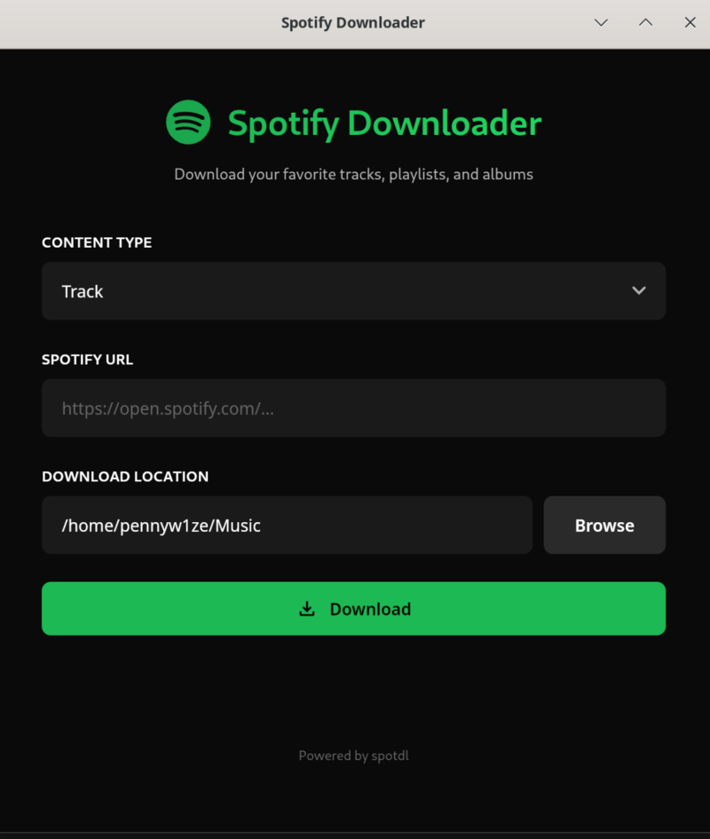
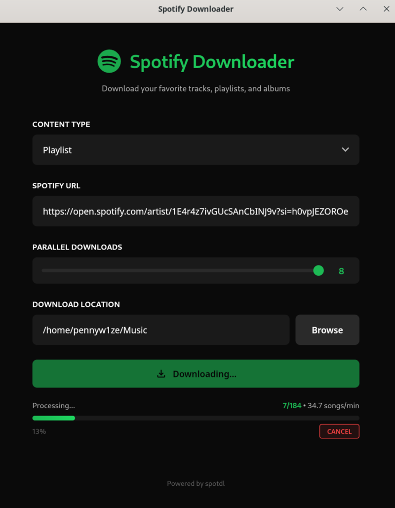

# SpotifyDownloader

A modern desktop application to download music from Spotify, built with **Tauri + React**.


## Features

- Download tracks, playlists, and albums;
- Native desktop app;
- Modern Spotify-themed UI;
- Fast parallel downloads;
- Custom download location;

---

## Requirements

### For the Desktop App (Tauri + React)

- **Node.js** (v18+) and npm
- **Rust** and Cargo
- **WebKitGTK** (Linux only)

```bash
# Check Node.js
node --version

# Check Rust
cargo --version

# Install WebKitGTK (Linux)
# Arch
sudo pacman -S webkit2gtk-4.1

# Ubuntu/Debian
sudo apt install libwebkit2gtk-4.1-dev
```

---

## Run the Desktop App

```bash
cd spotify-downloader-gui

# Install dependencies (first time only)
npm install

# Run in development mode
npm run tauri dev

# Build for production
npm run tauri build
```

Or from the SpotifyDownloader folder simplified run:
```bash
chmod +x run-app.sh && ./run-app.sh
```

---

## Command Line Interface (CLI)

For traditional command-line usage:

```bash
cd src
python3 main.py
```

---

## Project Structure

```
SpotifyDownloader/
├── spotify-downloader-gui/    # Tauri + React desktop app
│   ├── src/                   # React frontend
│   │   ├── App.tsx            # Main UI component
│   │   └── App.css            # Styles
│   └── src-tauri/             # Rust backend
│       └── src/lib.rs         # Backend commands
├── src/                       # Python CLI
│   └── main.py                # CLI entry point
└── README.md
```

---

## Create desktop icon

> [!WARNING]
> Substitute "/path/to" with the actual path to the spotify downloader folder in:
> - The command line below;
> - The run-app.sh file at line 2;
> - The spotify-downloader-sample.desktop file at line 4 and 5;

Add the desktop icon in order to be able to run the application from the menu:
```bash
chmod +x /path/to/Projects/SpotifyDownloader/spotify-downloader.desktop && \
cp /path/to/Projects/SpotifyDownloader/spotify-downloader.desktop ~/.local/share/applications/ && \
update-desktop-database ~/.local/share/applications/
```

## Screenshots







## License

GNU General Public License.
Feel free to redistribute and upgrade the project.
